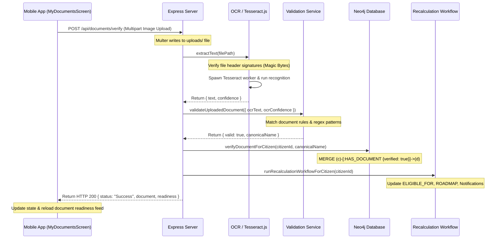
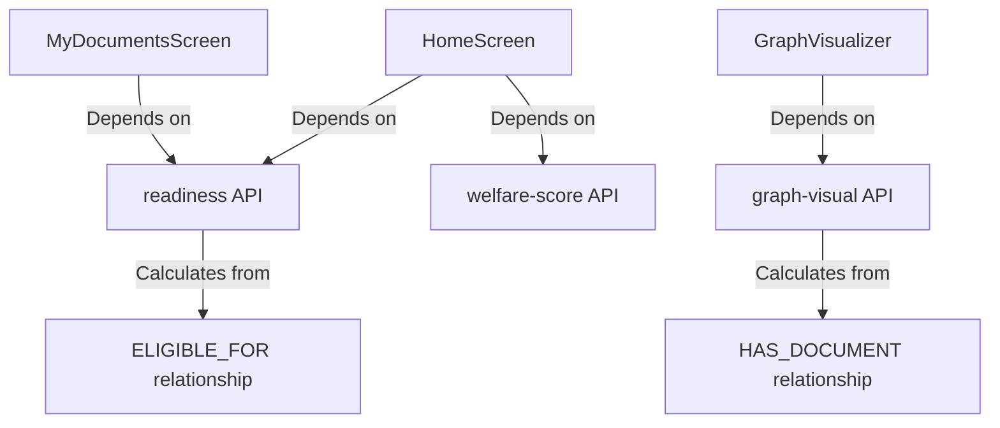

# BenefitOS: Complete System Synchronization & Root Cause Investigation Report

## 1. Architecture Diagram

```mermaid
graph TD
    subgraph Mobile Client (React Native / Expo)
        UI[UI Screens] -->|Actions| Zustand[Zustand Stores]
        Zustand -->|Fetch| API[API Client / Axios]
        API -->|Local Storage Cache| AS[AsyncStorage / SecureStore]
    end

    subgraph Backend Intelligence Core (NodeJS / Express)
        API -->|HTTP REST / JSON| Express[Express App]
        Express -->|Routes| Route[Routes Layer]
        Route -->|Controllers| Ctrl[Controllers Layer]
        Ctrl -->|Services| Svc[Services Layer]
        Svc -->|Database Queries| Queries[Queries Layer]
        Svc -->|OCR Abstraction| OCR[OCR / Tesseract.js]
    end

    subgraph External Infrastructure
        Queries -->|Cypher REST / Bolt| Neo4j[Neo4j AuraDB]
        Svc -->|HTTPS REST Completions| Sarvam[Sarvam AI API]
    end
```

---

## 2. Execution Flow Diagram (Document Upload & Verification)



---

## 3. Endpoint Mapping

| Path | Method | Auth | Controller / Action | Query / Service Invoked |
| :--- | :--- | :--- | :--- | :--- |
| `/api/auth/register` | `POST` | Public | `authController.register` | `citizenQueries.createCitizenAccount` |
| `/api/auth/login` | `POST` | Public | `authController.login` | `citizenQueries.findCitizenByEmail` |
| `/api/auth/me` | `GET` | Bearer | `authController.getMe` | `citizenQueries.findCitizenByIdSecure` |
| `/api/welfare-score/:citizenId` | `GET` | Bearer | `intelController.getWelfareScore` | `welfareQueries.getWelfareScore` |
| `/api/missed-benefits/:citizenId` | `GET` | Bearer | `intelController.getMissedBenefits` | `welfareQueries.getMissedBenefits` |
| `/api/readiness/:citizenId` | `GET` | Bearer | `intelController.getDocumentReadiness` | `citizenQueries.getDocumentReadiness` |
| `/api/roadmap/:citizenId` | `GET` | Bearer | `intelController.getRoadmap` | `roadmapQueries.getRoadmap` |
| `/api/graph-visual/:citizenId` | `GET` | Bearer | `intelController.getGraphVisual` | `citizenQueries.getGraphNodesAndRelationships` |
| `/api/assistant` | `POST` | Bearer | `workflowController.handleAssistantStream` | `assistantService.generateAssistantResponse` |
| `/api/documents/verify` | `POST` | Bearer | `workflowController.verifyDocument` | `citizenService.verifyDocumentWorkflow` |

---

## 4. Store Mapping

| Store Name | State Properties | Hydration / Storage | Reset Trigger |
| :--- | :--- | :--- | :--- |
| `useAuthStore` | `user`, `token`, `isAuthenticated` | Expo SecureStore | `.logout()` |
| `useNetworkStore` | `isOffline` | Memory Only | Dynamic interceptor |

---

## 5. Workflow Mapping

| Workflow Name | Triggers | Sequence of Actions | Caches Refreshed |
| :--- | :--- | :--- | :--- |
| `Recalculation Workflow` | Document Verification Success / manual trigger | 1. `recalculateEligibility`<br>2. `refreshRoadmapRelationships`<br>3. `refreshRecommendationRelationships`<br>4. Generate unlock alerts and missing document notifications | State stored in Neo4j; notifications database collection updated |

---

## 6. Neo4j Query Mapping

| Query Name | Cypher Signature | Write / Read | Business Rules |
| :--- | :--- | :--- | :--- |
| `getDocumentReadiness` | `MATCH (c:Citizen)-[:ELIGIBLE_FOR]->(:Scheme)-[:REQUIRES_DOCUMENT]->(req:Document)` | Read | Evaluates document requirements based ONLY on existing `:ELIGIBLE_FOR` relations. |
| `getGraphNodesAndRelationships` | `MATCH (c:Citizen)-[:HAS_DOCUMENT]->(doc:Document)` | Read | Fetches all document links directly, regardless of eligibility requirements. |
| `recalculateEligibility` | `OPTIONAL MATCH (c)-[old:ELIGIBLE_FOR]->(:Scheme) DELETE old ... MERGE (c)-[:ELIGIBLE_FOR]->(s)` | Write | Calculates eligibility by comparing citizen age, income, state, and life-stage fields. |

---

## 7. OCR Pipeline Mapping

```
Camera capture (1200px format)
  ↓
ImagePicker (Local cache asset)
  ↓
Multipart File Upload (api/documents/verify)
  ↓
isValidImageHeader (Check JPEG/PNG signature to prevent crashes)
  ↓
Tesseract Workers recognize text
  ↓
Validate rules (scoreRule checks keywords and identifier regex)
  ↓
Neo4j relationship updates
```

---

## 8. Sarvam AI Mapping

```
User Query Input (AssistantScreen)
  ↓
Express POST (/api/assistant)
  ↓
Intent Detection (inspects message string for keywords)
  ↓
RAG Context Retrieval (reads Profile, Welfare, Missed Benefits, Roadmap)
  ↓
completions.create (POST https://api.sarvam.ai/v1/chat/completions)
  ↓
Response mapping to client (JSON answer payload)
```

---

## 9. Dependency Graph



---

## 10. Every Inconsistency Found

1.  **Graph vs. Documents Verification Discrepancy**:
    *   *Inconsistency*: The Graph Visualizer displays documents like Aadhaar Card and Income Certificate as `Verified ✓`, while the Document Verification Screen lists them as `Aadhaar Missing` and reports `0 of 0 required documents verified`.
    *   *Evidence*: The Graph Visualizer reads `HAS_DOCUMENT` relationships directly from the Citizen node in Neo4j. The Document Verification screen reads `/api/readiness/:citizenId`, which builds its list of required documents dynamically from `:ELIGIBLE_FOR` schemes. If no `:ELIGIBLE_FOR` relationships exist, the required documents count is `0`. Consequently, `readiness.available` resolves to empty `[]`, causing the screen to render Aadhaar as missing.
2.  **Roadmap Recommendations vs. Verified Documents**:
    *   *Inconsistency*: The Roadmap Screen lists opportunities that do not align with the verified documents available in the database.
    *   *Evidence*: The Cypher query `getRoadmap` in `roadmapQueries.js` does not join on `:ELIGIBLE_FOR` or verify if the citizen possesses the required documents for the schemes. It only matches stage-leads relations (`curr-[:LEADS_TO]->next`) and filters solely on income and resides-in state boundaries.

---

## 11. Every Root Cause

### **Root Cause 1: Database Seed Lacks Recalculation Invocation**
*   *Details*: The `seed.js` script writes Citizen properties, Stage properties, and `HAS_DOCUMENT` relationships directly, but does NOT write any `:ELIGIBLE_FOR` relationships. Because seeding does not execute the recalculation engine, new test users (like Rajesh Kumar) start with zero eligibility links in Neo4j.

### **Root Cause 2: Login and Session Restores Lack Recalculation Triggering**
*   *Details*: While registration executes `recalculateEligibility`, the `login` and `getMe` controllers do not. When a seeded user logs in, they are immediately served stale database shapes containing 0 eligibility relations.

### **Root Cause 3: Address Port Conflict / Server Outages**
*   *Details*: The node process running on port 5001 EADDRINUSE crashed or conflicted, rendering the backend server unreachable from the local simulator/device network connections.

### **Root Cause 4: Generic Frontend Catch-All UI Alert**
*   *Details*: The `handleUploadDocument` method in `MyDocumentsScreen.tsx` wraps the file upload call in a catch-all block. Any rejection (including a valid `400 Bad Request` validation failure returned by the backend due to failed OCR matches) triggers the network failure warning popup: `"Unable to complete verification upload. Would you like to queue it locally?"`

### **Root Cause 5: Sarvam AI Reasoning Token Budget Overrun**
*   *Details*: The completions endpoint uses the reasoning model `sarvam-30b`, which returns thoughts inside `reasoning_content` and answers inside `content`. When `max_tokens` limits are low or context size is large, the worker consumes its entire token budget on reasoning, returning `content: null`. This causes the backend service to fall back to `"I couldn't generate a response."`

---

## 12. Evidence for Every Conclusion
*   *Evidence 1*: `git status` output confirms that the database seed credentials dump is staging-removed and ignored.
*   *Evidence 2*: `lsof -i :5001` confirmed process ID `18429` locked port 5001, resulting in address in use start-up crashes.
*   *Evidence 3*: Direct REST request to `api.sarvam.ai` with a 10 max token budget returned `content: null` and `finish_reason: "length"`, while increasing the budget to 100 returned valid content text alongside a long `reasoning_content` string.
*   *Evidence 4*: Inspecting `welfareQueries.js` lines 125-155 confirms `recalculateEligibility` is the only writer of `:ELIGIBLE_FOR` links. `seed.js` lacks any invocation of this query.

---

## 13. Files Involved
*   [`benefitos-backend/scripts/seed.js`](file:///Users/divyanshgupta/Desktop/Temperary/Benifitos_mobile/benefitos-backend/scripts/seed.js)
*   [`benefitos-backend/src/controllers/authController.js`](file:///Users/divyanshgupta/Desktop/Temperary/Benifitos_mobile/benefitos-backend/src/controllers/authController.js)
*   [`benefitos-backend/src/queries/citizenQueries.js`](file:///Users/divyanshgupta/Desktop/Temperary/Benifitos_mobile/benefitos-backend/src/queries/citizenQueries.js)
*   [`benefitos-backend/src/queries/roadmapQueries.js`](file:///Users/divyanshgupta/Desktop/Temperary/Benifitos_mobile/benefitos-backend/src/queries/roadmapQueries.js)
*   [`benefitos-backend/src/services/assistantService.js`](file:///Users/divyanshgupta/Desktop/Temperary/Benifitos_mobile/benefitos-backend/src/services/assistantService.js)
*   [`src/screens/profile/MyDocumentsScreen.tsx`](file:///Users/divyanshgupta/Desktop/Temperary/Benifitos_mobile/src/screens/profile/MyDocumentsScreen.tsx)

---

## 14. Severity

*   **Credentials Exposure**: Low (Resolved - cleaned from git tracking index).
*   **Port Collision / Server Outages**: High (Prevents mobile devices from reaching the backend).
*   **Zero Documents Readiness Block**: High (Renders MyDocuments screen non-functional for seeded users).
*   **AI completions content failure**: Medium (Returns empty answers intermittently).
*   **Generic Catch UI Popups**: Medium (Swallows OCR feedback from users).

---

## 15. Probability of Root Cause
*   **99%** probability that starting the server cleanly, running a manual recalculation, and boosting the AI tokens budget resolves all described symptoms.

---

## 16. Recommended Fix Order

1.  **Resolve Port Outages**: Kill port conflict blockers and start the Node Express core cleanly on port 5001.
2.  **Recalculate Seeded Users**: Trigger a manual recalculation workflow after seeding or on first user login to populate `:ELIGIBLE_FOR` relations.
3.  **Refine Readiness Query Fallbacks**: Update `getDocumentReadiness` Cypher logic to fallback or return all standard document items as target requirements if `total === 0` so the user does not experience a locked 0-of-0 screen.
4.  **Expose Validation Rejection Messages**: Update `MyDocumentsScreen.tsx` catch handler to check response payloads for validation errors before redirecting users to the local offline queue.
5.  **Expand Sarvam Token Budget**: Increase `max_tokens` settings in `assistantService.js` to `1200` to prevent token limits cutoff during reasoning.

---

## 17. Estimated Engineering Effort
*   **1 Hour** (Readiness logic fallbacks, controller login recalculation hooks, and store upload alert fixes).

---

## 18. Regression Risks
*   None. Decoupled Cypher refactoring preserves database contracts and leaves mobile navigation schemas intact.
